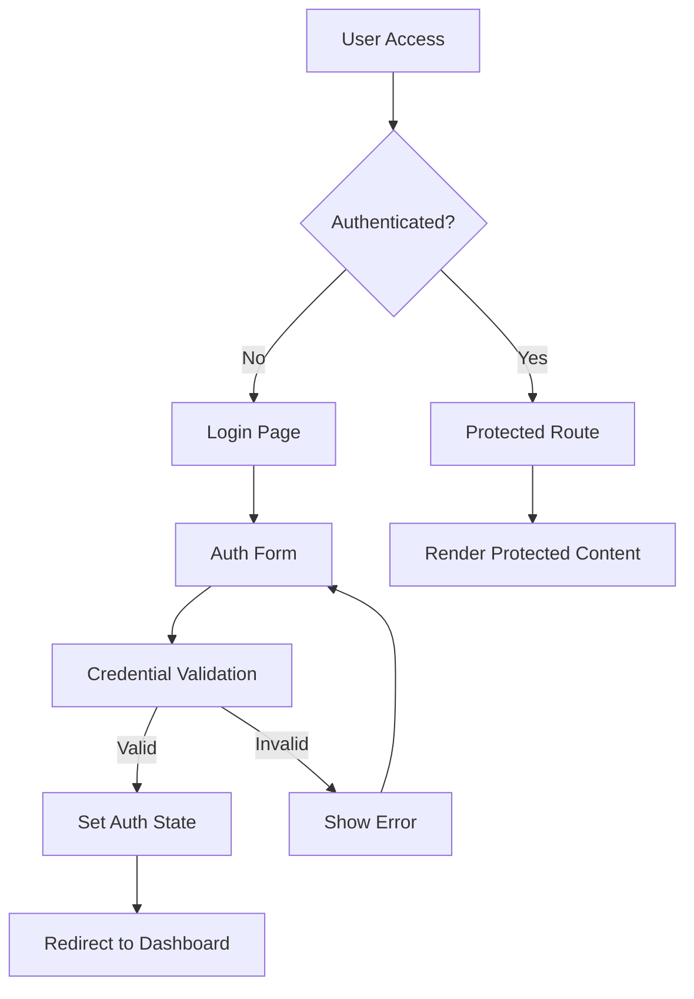
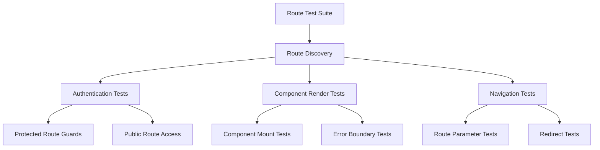

# Design Document

## Overview

This design addresses the implementation of comprehensive frontend route testing and proper authentication flow for the Healthcare DLT system. The current system bypasses authentication and displays mock data directly, which needs to be resolved with a proper authentication guard system and comprehensive route testing suite.

## Architecture

### Authentication Flow Architecture



### Route Testing Architecture



## Components and Interfaces

### 1. Authentication System

#### AuthProvider Context
```typescript
interface AuthContextType {
  user: User | null
  isAuthenticated: boolean
  isLoading: boolean
  login: (credentials: LoginCredentials) => Promise<void>
  logout: () => void
  checkAuth: () => Promise<boolean>
}
```

#### Route Guard Component
```typescript
interface RouteGuardProps {
  children: React.ReactNode
  requireAuth?: boolean
  allowedRoles?: UserRole[]
  redirectTo?: string
}
```

#### Authentication Hook
```typescript
interface UseAuthReturn {
  user: User | null
  isAuthenticated: boolean
  isLoading: boolean
  login: (credentials: LoginCredentials) => Promise<void>
  logout: () => void
}
```

### 2. Route Testing System

#### Route Test Configuration
```typescript
interface RouteTestConfig {
  path: string
  component: string
  requiresAuth: boolean
  allowedRoles?: UserRole[]
  expectedStatusCode: number
  testParams?: Record<string, string>
}
```

#### Test Suite Interface
```typescript
interface RouteTestSuite {
  discoverRoutes: () => Promise<RouteTestConfig[]>
  testRoute: (config: RouteTestConfig) => Promise<TestResult>
  generateReport: (results: TestResult[]) => TestReport
}
```

### 3. Data Source Management

#### Data Configuration
```typescript
interface DataConfig {
  useMockData: boolean
  apiEndpoint: string
  fallbackToMock: boolean
  mockDataIndicator: boolean
}
```

#### Data Provider Interface
```typescript
interface DataProvider {
  getData: <T>(endpoint: string) => Promise<T>
  isMockData: () => boolean
  toggleDataSource: (useMock: boolean) => void
}
```

## Data Models

### Authentication Models

```typescript
interface User {
  id: string
  userId: string
  role: UserRole
  permissions: string[]
  lastLogin: Date
  publicKeys?: {
    kyberPublicKey: string
    dilithiumPublicKey: string
  }
}

interface LoginCredentials {
  userId: string
  password: string
}

interface AuthState {
  user: User | null
  token: string | null
  isAuthenticated: boolean
  isLoading: boolean
}
```

### Route Testing Models

```typescript
interface TestResult {
  path: string
  status: 'pass' | 'fail' | 'skip'
  statusCode: number
  renderTime: number
  errors: string[]
  warnings: string[]
}

interface TestReport {
  totalRoutes: number
  passedRoutes: number
  failedRoutes: number
  skippedRoutes: number
  results: TestResult[]
  generatedAt: Date
}
```

## Error Handling

### Authentication Errors

1. **Invalid Credentials**: Display user-friendly error message
2. **Network Errors**: Show retry mechanism with offline indicator
3. **Token Expiration**: Automatic logout and redirect to login
4. **Key Generation Failures**: Detailed error reporting with recovery options

### Route Testing Errors

1. **Component Render Failures**: Capture and report component errors
2. **Navigation Failures**: Log routing issues and fallback routes
3. **Authentication Guard Failures**: Test and report guard behavior
4. **Network Timeouts**: Handle API call failures gracefully

### Data Source Errors

1. **API Failures**: Automatic fallback to mock data when configured
2. **Mock Data Loading**: Error handling for missing mock data files
3. **Configuration Errors**: Validation and reporting of invalid configurations

## Testing Strategy

### 1. Authentication Testing

#### Unit Tests
- AuthProvider context functionality
- Login/logout operations
- Token management
- Route guard logic

#### Integration Tests
- Complete authentication flow
- Route protection verification
- Session persistence
- Error handling scenarios

### 2. Route Testing Framework

#### Automated Route Discovery
```typescript
// Scan app directory for route files
const discoverRoutes = async (): Promise<RouteTestConfig[]> => {
  // Implementation to scan filesystem and extract route configurations
}
```

#### Route Validation Tests
- Component rendering without errors
- Proper HTTP status codes
- Authentication requirements
- Role-based access control

#### Navigation Tests
- Route transitions
- Parameter handling
- Redirect behavior
- Browser history management

### 3. Data Source Testing

#### Mock Data Validation
- Verify mock data structure matches API responses
- Test data provider switching
- Validate fallback mechanisms

#### API Integration Testing
- Test real API endpoints
- Verify error handling
- Test authentication with API calls

## Implementation Phases

### Phase 1: Authentication System
1. Implement AuthProvider context
2. Create route guard components
3. Update main layout with authentication checks
4. Implement login/logout functionality

### Phase 2: Route Protection
1. Identify and categorize all routes
2. Apply route guards to protected routes
3. Implement role-based access control
4. Add authentication redirects

### Phase 3: Route Testing Framework
1. Create route discovery mechanism
2. Implement automated route testing
3. Build test reporting system
4. Integrate with existing test suite

### Phase 4: Data Source Management
1. Implement data provider abstraction
2. Add mock/real data switching
3. Create visual indicators for data source
4. Implement fallback mechanisms

## Security Considerations

### Authentication Security
- Secure token storage (httpOnly cookies or secure localStorage)
- Token expiration and refresh mechanisms
- Protection against CSRF attacks
- Secure logout with token invalidation

### Route Security
- Server-side route validation
- Client-side route guards as UX enhancement only
- Proper error messages that don't leak information
- Rate limiting on authentication endpoints

### Data Security
- Encryption of sensitive data in transit and at rest
- Proper error handling that doesn't expose system details
- Audit logging of authentication events
- Secure handling of cryptographic keys

## Performance Considerations

### Authentication Performance
- Lazy loading of authentication components
- Efficient token validation
- Minimal re-renders on auth state changes
- Optimized route guard checks

### Testing Performance
- Parallel route testing where possible
- Efficient component mounting/unmounting
- Optimized test data generation
- Caching of test results where appropriate

## Configuration Management

### Environment-Based Configuration
```typescript
const authConfig = {
  development: {
    useMockAuth: true,
    tokenExpiry: '24h',
    enableDebugLogs: true
  },
  production: {
    useMockAuth: false,
    tokenExpiry: '1h',
    enableDebugLogs: false
  }
}
```

### Feature Flags
- Mock data toggle
- Authentication bypass (development only)
- Route testing automation
- Debug mode indicators