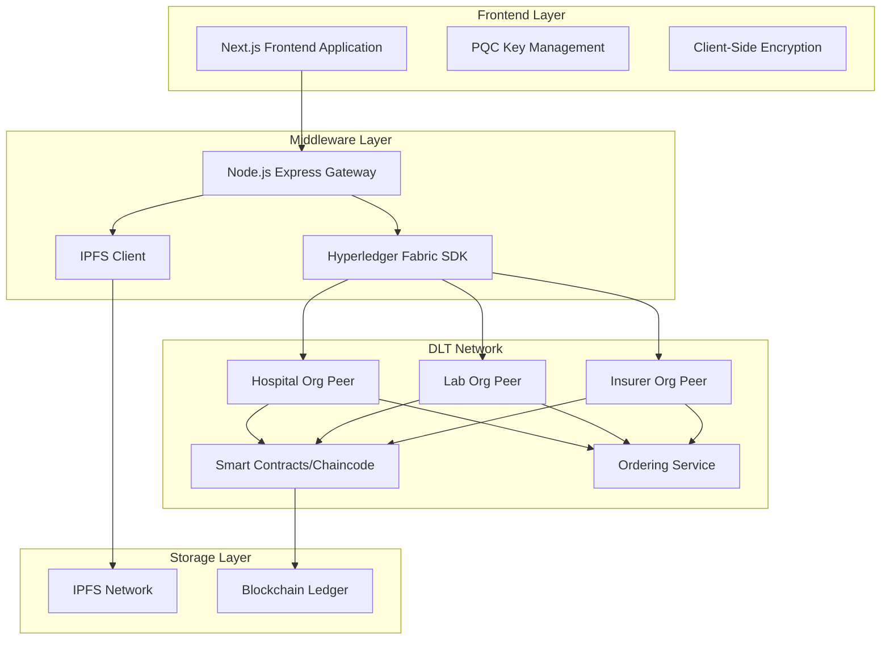

# Healthcare DLT Core System Design

## Overview

The Healthcare DLT Core system is a quantum-resistant, permissioned blockchain-based healthcare record management platform. The system consists of four primary components: a Hyperledger Fabric DLT network with smart contracts, a Next.js frontend application, a Node.js middleware gateway, and IPFS decentralized storage. The architecture emphasizes post-quantum cryptographic security, patient data ownership, and regulatory compliance.

## Architecture

### High-Level Architecture Diagram



### Component Architecture

The system follows a layered architecture pattern with clear separation of concerns:

1. **Presentation Layer**: Next.js frontend with client-side cryptography
2. **API Gateway Layer**: Node.js middleware for blockchain and IPFS integration
3. **Business Logic Layer**: Smart contracts (chaincode) on Hyperledger Fabric
4. **Data Layer**: Blockchain ledger for metadata and IPFS for encrypted files

## Components and Interfaces

### 1. Frontend Application (Next.js)

**Purpose**: Provides user interfaces for all system roles with client-side cryptographic operations.

**UI Framework**: Built using shadcn/ui component library for modern, accessible, and customizable UI components. Components will be installed and managed using MCP (Model Context Protocol) tooling.

**Key Modules**:
- **Authentication Module**: Handles PQC key generation and signature-based authentication using shadcn/ui forms and dialogs
- **Record Management Module**: Encrypts/decrypts medical records client-side with shadcn/ui data tables and cards
- **Consent Management Module**: Manages patient consent tokens and permissions using shadcn/ui switches and badges
- **Admin Dashboard Module**: System administrator interface for user approvals with shadcn/ui tables and action buttons
- **Audit Viewer Module**: Displays immutable audit trails using shadcn/ui data tables with filtering and pagination

**UI Components Strategy**:
- Install shadcn/ui components on-demand using MCP tooling as features are implemented
- Utilize shadcn/ui's form, table, dialog, card, button, and navigation components
- Implement responsive design with shadcn/ui's responsive utilities
- Use shadcn/ui's theming system for consistent healthcare-appropriate styling

**Cryptographic Components**:
```typescript
interface PQCKeyManager {
  generateKyberKeyPair(): Promise<KyberKeyPair>
  generateDilithiumKeyPair(): Promise<DilithiumKeyPair>
  encryptWithAES256GCM(data: Buffer, key: Buffer): EncryptedData
  decryptWithAES256GCM(encryptedData: EncryptedData, key: Buffer): Buffer
  signWithDilithium(message: Buffer, privateKey: DilithiumPrivateKey): Signature
  verifyDilithiumSignature(message: Buffer, signature: Signature, publicKey: DilithiumPublicKey): boolean
}
```

**API Integration**:
```typescript
interface MiddlewareAPI {
  authenticate(signature: Signature, nonce: string): Promise<AuthToken>
  uploadRecord(encryptedData: Buffer, metadata: RecordMetadata): Promise<IPFSHash>
  grantConsent(patientId: string, providerId: string, permissions: Permission[]): Promise<ConsentToken>
  revokeConsent(consentTokenId: string): Promise<boolean>
  getAuditTrail(filters: AuditFilters): Promise<AuditEntry[]>
}
```

### 2. Middleware Gateway (Node.js Express)

**Purpose**: Acts as API bridge between frontend and blockchain/IPFS, handling transaction orchestration.

**Core Services**:
- **Authentication Service**: Validates PQC signatures and manages session tokens
- **Transaction Service**: Submits transactions to Hyperledger Fabric network
- **IPFS Service**: Manages encrypted file uploads and retrievals
- **Consent Service**: Orchestrates consent token creation and validation
- **Audit Service**: Retrieves and formats audit trail data

**Key Interfaces**:
```typescript
interface BlockchainService {
  submitTransaction(channelName: string, chaincodeName: string, functionName: string, args: string[]): Promise<TransactionResult>
  queryLedger(channelName: string, chaincodeName: string, functionName: string, args: string[]): Promise<QueryResult>
  registerUser(userId: string, role: UserRole, publicKeys: PublicKeys): Promise<boolean>
}

interface IPFSService {
  uploadFile(encryptedData: Buffer): Promise<string>
  retrieveFile(ipfsHash: string): Promise<Buffer>
  pinFile(ipfsHash: string): Promise<boolean>
}
```

**Security Middleware**:
```typescript
interface SecurityMiddleware {
  validateSignature(req: Request): Promise<boolean>
  rateLimiting(req: Request): Promise<boolean>
  auditLogging(req: Request, res: Response): void
}
```

### 3. Smart Contracts (Hyperledger Fabric Chaincode)

**Purpose**: Implements business logic for access control, consent management, and audit trails.

**Contract Modules**:

**User Management Contract**:
```javascript
class UserContract extends Contract {
  async registerUser(ctx, userId, role, publicKeys, approverSignature) {
    // Validate approver signature and role permissions
    // Store user registration with pending/approved status
  }
  
  async approveRegistration(ctx, userId, adminSignature) {
    // Validate admin signature
    // Update user status to approved
  }
}
```

**Consent Management Contract**:
```javascript
class ConsentContract extends Contract {
  async grantConsent(ctx, patientId, providerId, permissions, expirationTime, patientSignature) {
    // Validate patient signature
    // Create consent token with specified permissions
    // Log consent grant event
  }
  
  async revokeConsent(ctx, consentTokenId, patientSignature) {
    // Validate patient signature and ownership
    // Invalidate consent token
    // Log revocation event
  }
  
  async validateAccess(ctx, providerId, patientId, resourceType) {
    // Check active consent tokens
    // Validate provider permissions
    // Return access decision
  }
}
```

**Record Management Contract**:
```javascript
class RecordContract extends Contract {
  async createRecord(ctx, recordId, patientId, ipfsHash, metadata, providerSignature) {
    // Validate provider signature and permissions
    // Store record metadata and IPFS reference
    // Create audit entry
  }
  
  async accessRecord(ctx, recordId, providerId, providerSignature) {
    // Validate consent and permissions
    // Log access attempt
    // Return record metadata and IPFS hash
  }
}
```

**Audit Contract**:
```javascript
class AuditContract extends Contract {
  async logEvent(ctx, eventType, userId, resourceId, timestamp, signature) {
    // Create immutable audit entry
    // Include cryptographic proof of action
  }
  
  async getAuditTrail(ctx, filters, auditorSignature) {
    // Validate auditor permissions
    // Return filtered audit entries
  }
}
```

### 4. IPFS Storage Integration

**Purpose**: Provides decentralized storage for encrypted medical records.

**Storage Strategy**:
- All medical files encrypted client-side before upload
- IPFS content identifiers (CIDs) stored on blockchain
- Pinning strategy for data persistence across network nodes
- Redundancy through multiple IPFS nodes

**Integration Interface**:
```typescript
interface IPFSIntegration {
  uploadEncryptedFile(encryptedData: Buffer, metadata: FileMetadata): Promise<IPFSResult>
  retrieveEncryptedFile(ipfsHash: string): Promise<Buffer>
  verifyFileIntegrity(ipfsHash: string, expectedHash: string): Promise<boolean>
}
```

## Data Models

### User Data Model
```typescript
interface User {
  userId: string
  role: UserRole
  publicKeys: {
    kyberPublicKey: string
    dilithiumPublicKey: string
  }
  registrationStatus: 'pending' | 'approved' | 'rejected'
  approvedBy?: string
  createdAt: Date
  approvedAt?: Date
}

enum UserRole {
  PATIENT = 'patient',
  DOCTOR = 'doctor',
  LABORATORY = 'laboratory',
  INSURER = 'insurer',
  AUDITOR = 'auditor',
  SYSTEM_ADMIN = 'system_admin'
}
```

### Medical Record Data Model
```typescript
interface MedicalRecord {
  recordId: string
  patientId: string
  providerId: string
  recordType: RecordType
  ipfsHash: string
  encryptionKeyHash: string
  metadata: {
    title: string
    description: string
    createdAt: Date
    fileSize: number
    mimeType: string
  }
  signature: string
}

enum RecordType {
  DIAGNOSIS = 'diagnosis',
  PRESCRIPTION = 'prescription',
  LAB_RESULT = 'lab_result',
  IMAGING = 'imaging',
  CONSULTATION_NOTE = 'consultation_note'
}
```

### Consent Token Data Model
```typescript
interface ConsentToken {
  tokenId: string
  patientId: string
  providerId: string
  permissions: Permission[]
  expirationTime?: Date
  isActive: boolean
  createdAt: Date
  revokedAt?: Date
  signature: string
}

interface Permission {
  resourceType: RecordType
  accessLevel: 'read' | 'write'
  conditions?: string[]
}
```

### Audit Entry Data Model
```typescript
interface AuditEntry {
  entryId: string
  eventType: AuditEventType
  userId: string
  resourceId?: string
  timestamp: Date
  details: Record<string, any>
  signature: string
  blockNumber: number
  transactionId: string
}

enum AuditEventType {
  USER_REGISTRATION = 'user_registration',
  USER_APPROVAL = 'user_approval',
  RECORD_CREATED = 'record_created',
  RECORD_ACCESSED = 'record_accessed',
  CONSENT_GRANTED = 'consent_granted',
  CONSENT_REVOKED = 'consent_revoked',
  LOGIN_ATTEMPT = 'login_attempt'
}
```

## Error Handling

### Frontend Error Handling
- **Cryptographic Errors**: Key generation failures, encryption/decryption errors
- **Network Errors**: API timeouts, connection failures
- **Validation Errors**: Invalid signatures, malformed data
- **User Errors**: Insufficient permissions, expired sessions

### Middleware Error Handling
- **Blockchain Errors**: Transaction failures, endorsement policy violations
- **IPFS Errors**: Upload failures, retrieval timeouts
- **Authentication Errors**: Invalid signatures, expired tokens
- **Rate Limiting**: Request throttling, abuse prevention

### Smart Contract Error Handling
- **Permission Errors**: Unauthorized access attempts
- **Data Validation Errors**: Invalid input parameters
- **State Errors**: Conflicting transactions, invalid state transitions
- **Consensus Errors**: Endorsement failures, ordering service issues

### Error Response Format
```typescript
interface ErrorResponse {
  error: {
    code: string
    message: string
    details?: Record<string, any>
    timestamp: Date
    requestId: string
  }
}
```

## Testing Strategy

### Unit Testing
- **Frontend Components**: React component testing with Jest and React Testing Library
- **Cryptographic Functions**: PQC implementation testing with known test vectors
- **Middleware Services**: API endpoint testing with Supertest
- **Smart Contract Functions**: Chaincode unit testing with Hyperledger Fabric test framework

### Integration Testing
- **API Integration**: End-to-end API flow testing
- **Blockchain Integration**: Transaction submission and query testing
- **IPFS Integration**: File upload and retrieval testing
- **Cross-Component**: Frontend-to-blockchain data flow testing

### Security Testing
- **Cryptographic Validation**: PQC algorithm implementation verification
- **Access Control Testing**: Permission and consent validation
- **Signature Verification**: Digital signature authenticity testing
- **Data Integrity**: Encryption and hash verification testing

### Performance Testing
- **Transaction Throughput**: Blockchain transaction processing capacity
- **File Upload Performance**: IPFS upload and retrieval speed
- **Concurrent User Testing**: Multi-user system load testing
- **Cryptographic Performance**: PQC operation benchmarking

### Test Data Management
- **Synthetic Medical Data**: FHIR-compliant test records
- **Test User Accounts**: Pre-configured test users for each role
- **Mock Cryptographic Keys**: Test key pairs for development
- **Audit Trail Validation**: Expected audit entry verification